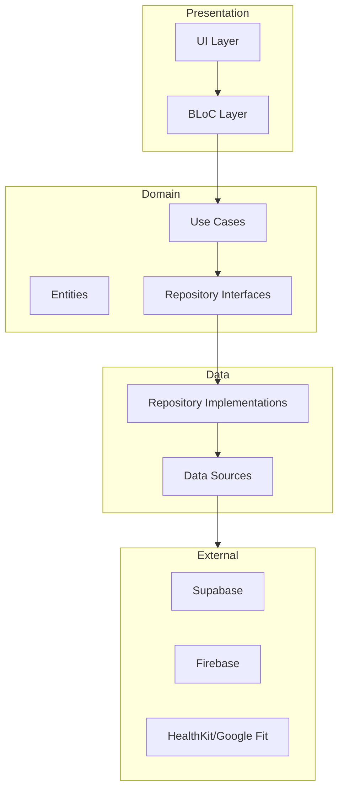

# Архитектурный План NutryFlow

## 1. Общая Архитектура

### 1.1 Архитектурный Стиль
- **Feature-First Architecture**: Модульная структура, основанная на функциональных возможностях
- **Clean Architecture**: Разделение на слои (presentation, domain, data)
- **SOLID Principles**: Строгое следование принципам SOLID
- **Dependency Injection**: Использование GetIt для управления зависимостями

### 1.2 Схема Архитектуры



## 2. Структура Проекта

```
lib/
├── core/
│   ├── config/
│   ├── error/
│   ├── network/
│   ├── storage/
│   └── utils/
├── features/
│   ├── auth/
│   ├── nutrition/
│   ├── water/
│   ├── activity/
│   └── profile/
├── shared/
│   ├── widgets/
│   ├── models/
│   └── services/
└── main.dart
```

## 3. Ключевые Компоненты

### 3.1 Core Module
- **Config**: Конфигурация приложения, константы
- **Error**: Обработка ошибок, исключения
- **Network**: HTTP клиент, интерцепторы
- **Storage**: Локальное хранилище
- **Utils**: Общие утилиты

### 3.2 Feature Modules

#### Auth Feature
- Аутентификация и авторизация
- Управление пользовательскими данными
- Интеграция с Supabase Auth

#### Nutrition Feature
- Управление питанием
- База данных продуктов
- Дневник питания
- Калькулятор калорий

#### Water Feature
- Отслеживание водного баланса
- Напоминания
- Статистика потребления

#### Activity Feature
- Отслеживание тренировок
- Интеграция с HealthKit/Google Fit
- Календарь тренировок

#### Profile Feature
- Управление профилем
- Настройки целей
- Персонализация

### 3.3 Shared Module
- Общие виджеты
- Общие модели
- Общие сервисы

## 4. Технический Стек

### 4.1 Frontend
- **Framework**: Flutter
- **State Management**: BLoC
- **Navigation**: GoRouter
- **DI**: GetIt
- **UI**: Material Design 3

### 4.2 Backend
- **Auth**: Supabase Auth
- **Database**: Supabase PostgreSQL
- **Storage**: Supabase Storage
- **Functions**: Supabase Edge Functions

### 4.3 Analytics & Notifications
- **Analytics**: Firebase Analytics
- **Notifications**: Firebase Cloud Messaging
- **Crash Reporting**: Firebase Crashlytics

## 5. Интеграции

### 5.1 HealthKit/Google Fit
- Отслеживание физической активности
- Синхронизация данных о здоровье
- Получение метрик

### 5.2 Supabase
- Аутентификация
- Хранение данных
- Реалтайм обновления
- Edge Functions

### 5.3 Firebase
- Аналитика
- Push-уведомления
- Отчеты о сбоях

## 6. Безопасность

### 6.1 Аутентификация
- JWT токены
- OAuth 2.0
- Биометрическая аутентификация

### 6.2 Данные
- Шифрование локальных данных
- Безопасное хранение на сервере
- GDPR compliance

### 6.3 Сеть
- HTTPS
- Certificate Pinning
- Защита от MITM

## 7. Производительность

### 7.1 Оптимизация
- Ленивая загрузка
- Кэширование данных
- Оптимизация изображений
- Минимизация сетевых запросов

### 7.2 Мониторинг
- Firebase Performance Monitoring
- Custom metrics
- Crash reporting

## 8. Тестирование

### 8.1 Unit Tests
- Тестирование бизнес-логики
- Тестирование репозиториев
- Тестирование сервисов

### 8.2 Widget Tests
- Тестирование UI компонентов
- Тестирование навигации
- Тестирование состояний

### 8.3 Integration Tests
- Тестирование фич
- Тестирование интеграций
- E2E тестирование

## 9. CI/CD

### 9.1 Непрерывная Интеграция
- Автоматические тесты
- Линтинг
- Анализ кода
- Сборка приложения

### 9.2 Непрерывная Доставка
- Автоматический деплой
- Версионирование
- Управление релизами

## 10. Масштабирование

### 10.1 Архитектурное
- Модульная структура
- Чистая архитектура
- Dependency injection

### 10.2 Техническое
- Оптимизация запросов
- Кэширование
- Балансировка нагрузки

## 11. Риски и Митигация

### 11.1 Технические Риски
- Производительность на старых устройствах
- Синхронизация данных
- Интеграция с HealthKit/Google Fit

### 11.2 Стратегии Митигации
- Оптимизация для старых устройств
- Оффлайн-режим
- Fallback механизмы

## 12. Дорожная Карта Разработки

### 12.1 Этап 1: MVP
- Базовая функциональность
- Основные фичи
- Интеграции

### 12.2 Этап 2: Оптимизация
- Производительность
- UX улучшения
- Стабильность

### 12.3 Этап 3: Расширение
- Новые фичи
- Социальные функции
- AI интеграции 