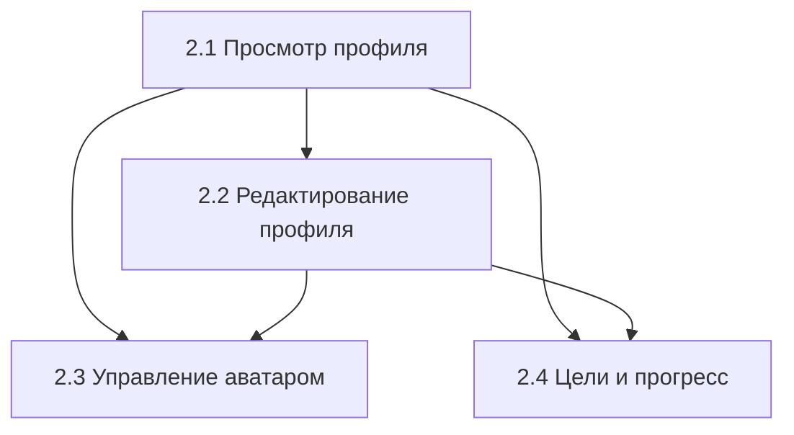

# User Stories: Профиль

> Этот файл содержит краткий обзор всех user stories для Epic 2 - Profile.  
> Детализированные версии находятся в отдельных файлах.

## 📋 Статус Stories

| Story | Название | Приоритет | Сложность | Статус | Файл |
|-------|----------|-----------|-----------|--------|------|
| 2.1 | Просмотр профиля | High | Medium | 📋 Ready | [2.1-profile-view.story.md](2.1-profile-view.story.md) |
| 2.2 | Редактирование профиля | High | Hard | 📋 Ready | [2.2-profile-edit.story.md](2.2-profile-edit.story.md) |
| 2.3 | Управление аватаром | Medium | Hard | 📋 Ready | [2.3-avatar-management.story.md](2.3-avatar-management.story.md) |
| 2.4 | Цели и прогресс | High | Hard | 📋 Ready | [2.4-goals-progress.story.md](2.4-goals-progress.story.md) |

## 🎯 Краткое описание Stories

### Story 2.1: Просмотр профиля
**Как** пользователь  
**Я хочу** просматривать свой профиль с полной информацией  
**Чтобы** видеть свои данные, прогресс и иметь быстрый доступ к настройкам

**Ключевые функции:**
- Отображение базовой информации (имя, email, возраст)
- Физические параметры с расчетом ИМТ
- Цели и достижения
- Быстрые действия (редактирование, настройки)

### Story 2.2: Редактирование профиля
**Как** пользователь  
**Я хочу** редактировать свои личные данные и параметры  
**Чтобы** поддерживать актуальность информации и улучшать персонализацию

**Ключевые функции:**
- Форма редактирования всех полей профиля
- Валидация в реальном времени
- Настройки диетических предпочтений
- Управление уведомлениями

### Story 2.3: Управление аватаром
**Как** пользователь  
**Я хочу** загружать, просматривать и изменять свой аватар  
**Чтобы** персонализировать профиль и сделать его более узнаваемым

**Ключевые функции:**
- Съемка через камеру или выбор из галереи
- Редактирование и обрезка изображений
- Загрузка в облачное хранилище
- Управление разрешениями

### Story 2.4: Цели и отслеживание прогресса
**Как** пользователь  
**Я хочу** устанавливать личные цели и отслеживать свой прогресс  
**Чтобы** мотивировать себя и видеть результаты своих усилий

**Ключевые функции:**
- Настройка целей по весу, активности, питанию
- Графики и визуализация прогресса
- Система достижений и мотивации
- Адаптивные рекомендации

## 🔗 Зависимости между Stories

**Рекомендуемый порядок разработки:**
1. **Story 2.1** - Просмотр профиля (основа для остальных)
2. **Story 2.2** - Редактирование профиля (ключевая функциональность)
3. **Story 2.3** - Управление аватаром (можно параллельно с 2.4)
4. **Story 2.4** - Цели и прогресс (самая сложная, требует данных из других stories)

## 📊 Общие метрики Epic 2

- **Общее количество AC**: 34+ критериев приемки
- **Ожидаемое время разработки**: 6-8 недель (команда из 2-3 разработчиков)
- **Приоритетные Stories**: 2.1, 2.2, 2.4
- **Техническая сложность**: High (интеграция с камерой, графики, сложная валидация)

## 🛠️ Общие технические требования

- **Архитектура**: Clean Architecture с BLoC/Cubit
- **Backend**: Supabase (база данных, хранилище файлов, аутентификация)
- **Тестирование**: Unit тесты + Widget тесты для всех компонентов
- **Дизайн**: Material Design 3, поддержка темной темы
- **Accessibility**: Полная поддержка для пользователей с ограниченными возможностями

## 🎨 Design System

Все stories используют единую дизайн-систему:
- Цветовая палитра из `AppColors`
- Типографика из темы приложения
- Консистентные компоненты (кнопки, поля ввода, карточки)
- Адаптивная верстка для всех размеров экранов

## ✅ Definition of Ready

Каждая Story считается готовой к разработке, если:
- [ ] Детальные Acceptance Criteria определены
- [ ] UI/UX дизайн согласован
- [ ] Технические зависимости выявлены
- [ ] API endpoints спроектированы
- [ ] Тестовые сценарии определены 